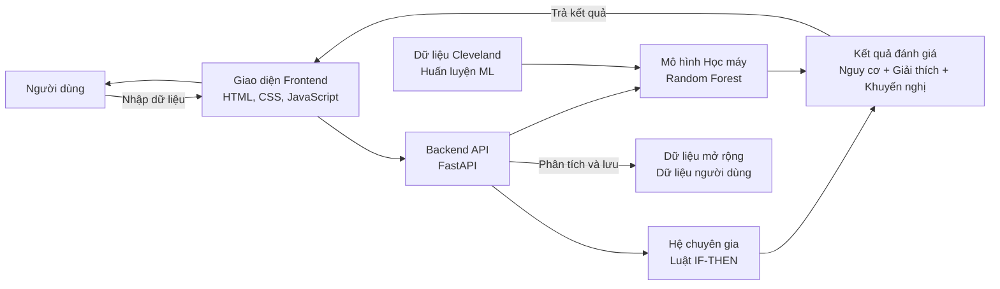

# Hệ Thống Dự Đoán Bệnh Tim

## Giới thiệu

Đây là dự án web hỗ trợ đánh giá nguy cơ bệnh tim bằng cách kết hợp:

- Hệ chuyên gia dựa trên luật `IF-THEN`.
- Mô hình học máy `Random Forest`.
- Giao diện nhập liệu trực quan cho người dùng.

Hệ thống nhận dữ liệu từ biểu mẫu lâm sàng, phân tích qua backend FastAPI, sau đó trả về:

- Mức nguy cơ.
- Giải thích các yếu tố ảnh hưởng.
- Khuyến nghị theo dõi và xử trí.

## Cấu trúc thư mục

```text
heart-disease-expert-system/
├── backend/
│   ├── main.py
│   ├── kbs_engine.py
│   ├── rule_weights.py
│   ├── ml_model/
│   │   ├── train_model.py
│   │   ├── random_forest.pkl
│   │   └── data/
│   │       ├── heart_disease_cleveland.csv
│   │       └── heart_disease_extended_inputs.csv
│   └── requirements.txt
├── frontend/
│   ├── index.html
│   ├── css/style.css
│   └── js/app.js
└── README.md
```

## Chức năng hiện có

- Form nhập `23` chỉ số tim mạch và triệu chứng mở rộng.
- Backend FastAPI nhận dữ liệu và trả kết quả dự đoán.
- Hệ chuyên gia chấm điểm nguy cơ theo luật suy luận.
- Trọng số 23 luật được cấu hình tập trung trong `backend/rule_weights.py`.
- Mô hình Random Forest dự đoán bổ sung trên bộ dữ liệu Cleveland.
- Phần `Độ tin cậy` được cập nhật theo từng ca phân tích, dựa trên mức nhất quán giữa hệ chuyên gia, xác suất ML và độ phủ dữ liệu huấn luyện.
- Tự lưu dữ liệu người dùng nhập vào file dữ liệu mở rộng để huấn luyện sau này.
- API kiểm tra kết nối và API lấy danh sách lựa chọn cho các trường nhập liệu.

## Bảng hoạt động hệ thống

| Bước | Thành phần | Hoạt động |
| --- | --- | --- |
| 1 | Frontend | Người dùng nhập dữ liệu từ biểu mẫu. |
| 2 | Frontend -> API | Dữ liệu được gửi tới `POST /api/predict`. |
| 3 | Backend API | Kiểm tra schema đầu vào bằng `HeartMetricsInput`. |
| 4 | Hệ chuyên gia | Áp dụng các luật `IF-THEN` để tính điểm nguy cơ. |
| 5 | Mô hình ML | Dùng `Random Forest` để đưa ra dự đoán bổ sung. |
| 6 | Backend API | Tổng hợp kết quả từ hệ chuyên gia và ML. |
| 7 | Backend API | Lưu dữ liệu người dùng nhập vào file CSV mở rộng. |
| 8 | Frontend | Hiển thị mức nguy cơ, giải thích và khuyến nghị. |

## Sơ đồ khối hệ thống

Ảnh bạn cung cấp tương ứng với sơ đồ khối sau:



Ý nghĩa các khối:

- `Người dùng`: nhập dữ liệu sức khỏe và triệu chứng.
- `Giao diện Frontend`: thu thập dữ liệu và hiển thị kết quả.
- `Backend API FastAPI`: trung tâm xử lý chính của hệ thống.
- `Hệ chuyên gia`: suy luận theo các luật chuyên môn.
- `Mô hình học máy`: dự đoán xác suất bổ sung.
- `Dữ liệu Cleveland`: bộ dữ liệu dùng để huấn luyện mô hình hiện tại.
- `Dữ liệu mở rộng`: dữ liệu mới người dùng nhập, lưu để huấn luyện sau này.
- `Kết quả đánh giá`: đầu ra cuối cùng trả về giao diện.

## Các API chính

- `GET /health`: kiểm tra backend có đang hoạt động hay không.
- `GET /api/options`: lấy danh sách lựa chọn cho các trường `select` trên form.
- `POST /api/predict`: gửi dữ liệu biểu mẫu để phân tích nguy cơ.
- `GET /api/predict/sample`: lấy một ca dữ liệu mẫu.
- `GET /api/demo-cases`: lấy danh sách ca minh họa dựng sẵn.

## Yêu cầu hệ thống

- Python **3.10** trở lên
- Trình duyệt web hiện đại (Chrome, Edge, Firefox)
- Không cần cài thêm Node.js hay bất kỳ công cụ build nào

## Cài đặt

### 1. Lấy mã nguồn

Sao chép (clone) hoặc giải nén dự án vào bất kỳ thư mục nào trên máy, ví dụ:

```
heart-disease-expert-system/
```

### 2. Tạo môi trường ảo

**Windows (PowerShell)**

```powershell
cd heart-disease-expert-system
python -m venv .venv
.venv\Scripts\Activate.ps1
```

**macOS / Linux**

```bash
cd heart-disease-expert-system
python3 -m venv .venv
source .venv/bin/activate
```

### 3. Cài thư viện

```bash
cd backend
pip install -r requirements.txt
```

### 4. Huấn luyện mô hình lần đầu

Nếu chưa có file `backend/ml_model/random_forest.pkl`, chạy lệnh sau trong thư mục `backend`:

```bash
python ml_model/train_model.py
```

Script sẽ:

- Chuẩn hóa dữ liệu từ `backend/ml_model/data/heart_disease_cleveland.csv`.
- Huấn luyện mô hình `RandomForestClassifier`.
- Lưu mô hình tại `backend/ml_model/random_forest.pkl`.

## Chạy dự án

Cần mở **2 terminal riêng biệt**, đều đã kích hoạt môi trường ảo (`.venv`).

### Terminal 1 — Backend

```bash
# Từ thư mục gốc dự án
cd backend
python -m uvicorn main:app --reload --host 127.0.0.1 --port 8000
```

Sau khi thấy dòng `Application startup complete.`, backend đã sẵn sàng:

| Địa chỉ | Mô tả |
| --- | --- |
| `http://127.0.0.1:8000/health` | Kiểm tra trạng thái |
| `http://127.0.0.1:8000/docs` | Swagger UI |

### Terminal 2 — Frontend

```bash
# Từ thư mục gốc dự án
cd frontend
python -m http.server 5500
```

Mở trình duyệt tại `http://127.0.0.1:5500`.

> **Lưu ý:** Đảm bảo chạy backend trước, frontend sau. Nếu đổi port backend, cập nhật `API_BASE_URL` trong `frontend/js/app.js`.

## Huấn luyện lại mô hình học máy

Chỉ cần thực hiện khi muốn cập nhật mô hình với dữ liệu mới:

```bash
# Từ thư mục backend
python ml_model/train_model.py
```

Dữ liệu đầu vào cần có tại:

```text
backend/ml_model/data/heart_disease_cleveland.csv
```

Kết quả được lưu vào `backend/ml_model/random_forest.pkl` và backend sẽ tự load lại khi khởi động.

## Dữ liệu mở rộng do người dùng nhập

Mỗi lần người dùng gửi biểu mẫu, hệ thống sẽ lưu thêm một dòng vào:

```text
backend/ml_model/data/heart_disease_extended_inputs.csv
```

File này chứa:

- Các trường nhập mới như hút thuốc, tiền sử tim bẩm sinh, tiểu đường, tiền sử gia đình, triệu chứng.
- Điểm expert system.
- Xác suất từ mô hình ML.
- Mức nguy cơ cuối cùng.
- Cột `confirmed_target` để sau này bổ sung nhãn thật khi huấn luyện supervised mở rộng.

## Thay đổi host hoặc port

Nếu backend không chạy ở `127.0.0.1:8000` (ví dụ khi deploy lên server), mở file `frontend/js/app.js` và sửa dòng:

```js
const API_BASE_URL = "http://127.0.0.1:8000";
```

thành địa chỉ thực tế, ví dụ:

```js
const API_BASE_URL = "http://192.168.1.100:8000";
```
